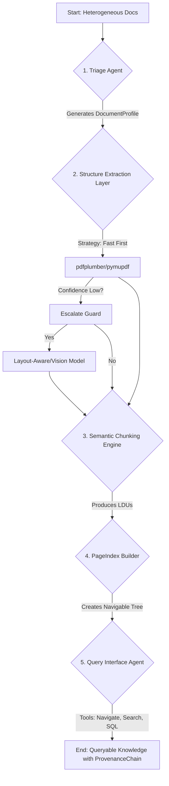

# DOMAIN_NOTES.md

This document captures our core architectural decisions, domain models, and observed failure modes. It serves as a living document for the Document Intelligence Refinery project.

## Extraction Strategy Decision Tree

This section will outline the logic for the **Triage Agent** and **Structure Extraction Layer**. The goal is to balance cost and quality by defaulting to cheaper methods and escalating to more expensive, vision-enabled models only when necessary.

```
1.  **Initial Check:** Is the document a native PDF with selectable text?
    *   **Yes:** Proceed with `pdfplumber` or `pymupdf` for text and table extraction.
        *   **Guard:** After extraction, does the extracted text-to-token ratio seem reasonable? Are tables detected with high confidence?
        *   **Yes:** Pass to Semantic Chunking.
        *   **No (Escalate):** The document might have a complex layout or invisible overlays. Re-process with a layout-aware model (e.g., a fine-tuned Docling or MinerU).
    *   **No (Scanned/Image-based):** Proceed directly to a Vision-Augmented model (e.g., Gemini Pro Vision).
        *   **Input:** Provide the model with the raw page image.
        *   **Prompt:** Instruct the model to return a structured JSON object containing all text, tables, and figures with their corresponding bounding box coordinates.
        *   **Guard:** Is the output parsable and does it contain valid coordinates?
        *   **Yes:** Pass to Semantic Chunking.
        *   **No (Failure):** Log the failure and flag for manual review.

```

## Observed Failure Modes

A log of common issues to inform the "Escalation Guard" logic.

| Document Type | Failure Mode | Escalation Path |
| :--- | :--- | :--- |
| **Digital PDF** | **Incorrect Reading Order:** Multi-column layouts cause text to be read row-by-row across columns. | Layout-Aware Model |
| **Digital PDF** | **Broken Tables:** Tables without clear borders are missed by `pdfplumber`. | Layout-Aware Model or Vision Model |
| **Digital PDF** | **"Fake" Digital:** A scanned image is wrapped in a PDF container, but has no selectable text. | Vision Model |
| **Scanned PDF** | **Low-Quality OCR:** Poor resolution or handwritten notes lead to character garbage. | Vision Model (often helps, but may still fail) |
| **Scanned PDF** | **Complex Graphics:** Diagrams and charts are ignored by basic OCR. | Vision Model (with prompts for chart extraction) |

## Pipeline Architecture

This Mermaid.js diagram illustrates the 5-stage pipeline.


